 

  

    <!-- <h2>SpatialRetrievalAD Summary Video</h2> -->
    

      <video width="100%" controls>
        <source src="./static/video/demo.mp4" type="video/mp4">
        Your browser does not support the video tag.
      </video>
    

  

<!-- Using HTML to center the abstract -->

    

        <h2>Abstract</h2>
        

&emsp;&emsp;Existing autonomous driving systems rely on onboard sensors (cameras, LiDAR, IMU, etc) for environmental perception. However, this paradigm is limited by the drive-time perception horizon and often fails under limited view scope, occlusion or extreme conditions such as darkness and rain. In contrast, human drivers are able to recall road structure even under poor visibility. To endow models with this "recall" ability, we propose the spatial retrieval paradigm, introducing offline retrieved geographic images as an additional input. These images are easy to obtain from offline caches (e.g, Google Maps or stored autonomous driving datasets) without requiring additional sensors, making it a plug-and-play extension for existing AD tasks.
 
&emsp;&emsp;For experiments, we first extend the nuScenes dataset with geographic images retrieved via Google Maps APIs and align the new data with ego-vehicle trajectories. We establish baselines across five core autonomous driving tasks: object detection, online mapping, occupancy prediction, end-to-end planning, and generative world modeling.  Extensive experiments show that the extended modality could enhance the performance of certain tasks. We will open-source dataset curation code, data, and benchmarks for further study of this new autonomous driving paradigm.
        

    

  

    

      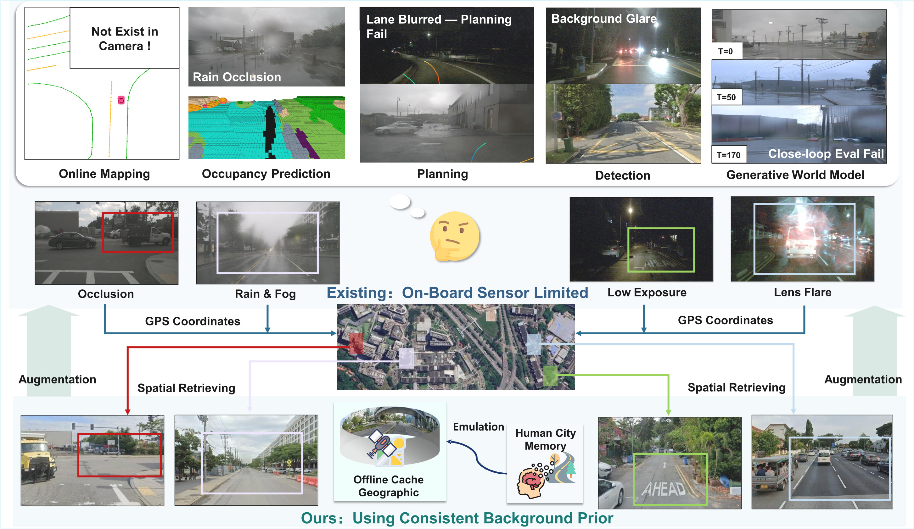
    

  

    

        <h2>nuScenes-Geography Dataset</h2>
        

        &emsp;&emsp;We extend the nuScenes dataset with geographic images retrieved via Google Maps APIs and align the new data with ego-vehicle trajectories. 
         
        &emsp;&emsp;The dataset and development toolkit are publicly available:
        <ul style="margin-top: 0.5em; margin-bottom: 0.5em;">
            <li><strong>Dataset:</strong> <a href="https://huggingface.co/datasets/SpatialRetrievalAD/nuScenes-Geography-Data" target="_blank">nuScenes-Geography-Data</a> on Hugging Face</li>
            <li><strong>Devkit:</strong> <a href="https://github.com/SpatialRetrievalAD/SpatialRetrievalAD-Dataset-Devkit" target="_blank">SpatialRetrievalAD-Dataset-Devkit</a> on GitHub</li>
        </ul>
        

    

  

    

      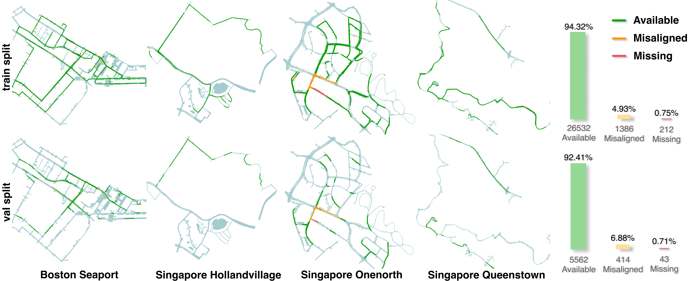
    

  

<!-- Multi Tasks -->

    

        <h2>Task Baselines</h2>
        

        &emsp;&emsp;To systematically investigate the spatial retrieval paradigm, we establish baselines across five key AD tasks: object detection, online mapping, occupancy prediction, end-to-end planning, and generative world modeling. We design a plug-and-play adapter to seamlessly integrate geographic images into existing models. Extensive experiments demonstrate this modality improves performance across tasks. All implementation repositories are hosted under the 
        <a href="https://github.com/SpatialRetrievalAD" target="_blank">SpatialRetrievalAD</a> organization:
        

        

            <table class="table is-striped is-fullwidth" style="margin: 0 auto;">
                <thead>
                    <tr>
                        <th style="text-align: left; padding: 0.75em;">Task</th>
                        <th style="text-align: center; padding: 0.75em;">Repository</th>
                    </tr>
                </thead>
                <tbody>
                    <tr>
                        <td style="text-align: left; padding: 0.75em;"><strong>Generative World Modeling</strong></td>
                        <td style="text-align: center; padding: 0.75em;">
                            <a href="https://github.com/SpatialRetrievalAD/Generative-World-Model" target="_blank">Generative-World-Model</a> 
                        </td>
                    </tr>
                    <tr>
                        <td style="text-align: left; padding: 0.75em;"><strong>End-to-End Planning</strong></td>
                        <td style="text-align: center; padding: 0.75em;">
                            <a href="https://github.com/SpatialRetrievalAD/End2End-Planning" target="_blank">End2End-Planning</a>
                        </td>
                    </tr>
                    <tr>
                        <td style="text-align: left; padding: 0.75em;"><strong>Online Mapping</strong></td>
                        <td style="text-align: center; padding: 0.75em;">
                            <a href="https://github.com/SpatialRetrievalAD/Online-Mapping" target="_blank">Online-Mapping</a>
                        </td>
                    </tr>
                    <tr>
                        <td style="text-align: left; padding: 0.75em;"><strong>Occupancy Prediction</strong></td>
                        <td style="text-align: center; padding: 0.75em;">
                            <a href="https://github.com/SpatialRetrievalAD/Occupancy-Prediction" target="_blank">Occupancy-Prediction</a>
                        </td>
                    </tr>
                    <tr>
                        <td style="text-align: left; padding: 0.75em;"><strong>Object Detection</strong></td>
                        <td style="text-align: center; padding: 0.75em;">
                            <a href="https://github.com/SpatialRetrievalAD/3D-Detection" target="_blank">3D-Detection</a>
                        </td>
                    </tr>
                </tbody>
            </table>
        

    

<!-- Dataset Visualization -->

    

        <h2>Dataset Visualization</h2>
        

        The following figures show the correspondence between Geography images and nuScenes images:
        

    

  

    

      
    

  

  

    

      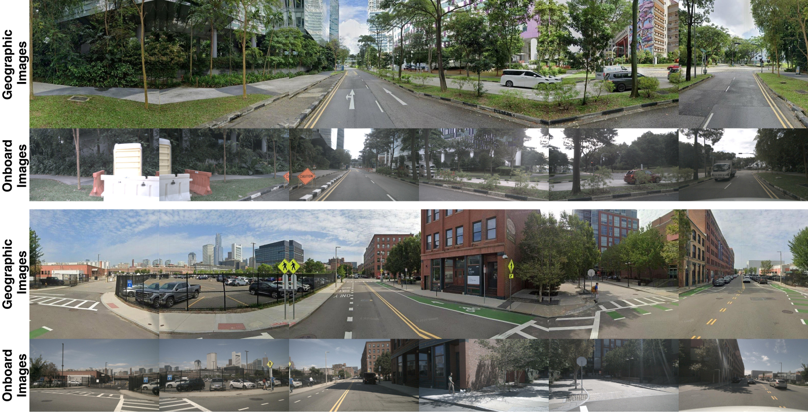
    

  

  

    

        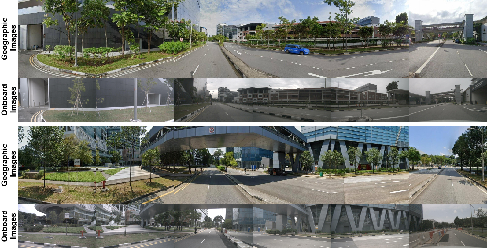
    

  

<!-- Quantitative Comparison -->

    

        <h2>Comparison</h2>
        

        

    

<!-- Generative World Model Results -->

  

    

      
<strong>Generative World Model Results.</strong> Conditioning UniMLVG and MagicDriveDiT on geographic images leads to lower FVD and FID, effectively preventing scene drift and preserving geometric consistency during rollouts. This demonstrates that spatial retrieval provides a structural scaffold for coherent world modeling.

    

  

  

    

      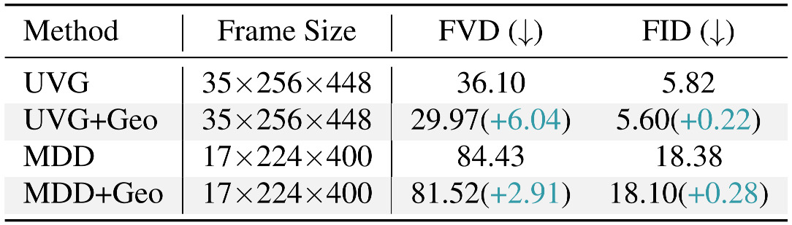
    

  

  

    

      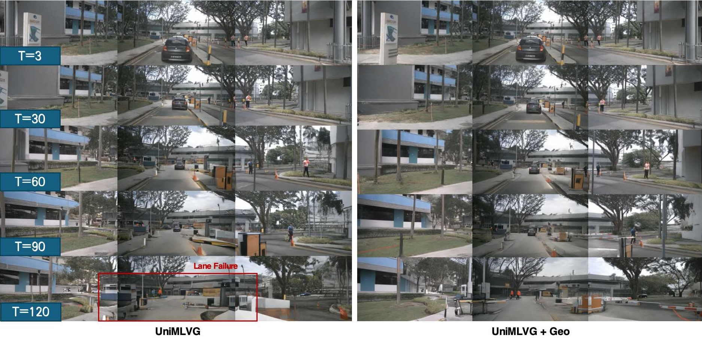
    

  

<!-- Online Mapping Results -->

  

    

      
<strong>Online Mapping Results.</strong> Integrating geographic priors into MapTR and MapTRv2 substantially improves online mapping. The extra background information enables recovery of occluded lanes.

    

  

  

    

      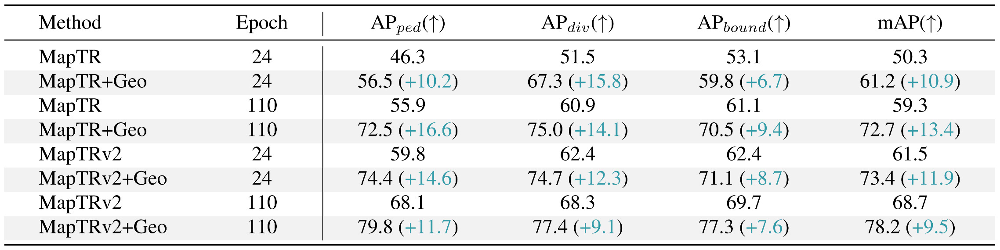
    

  

  

    

      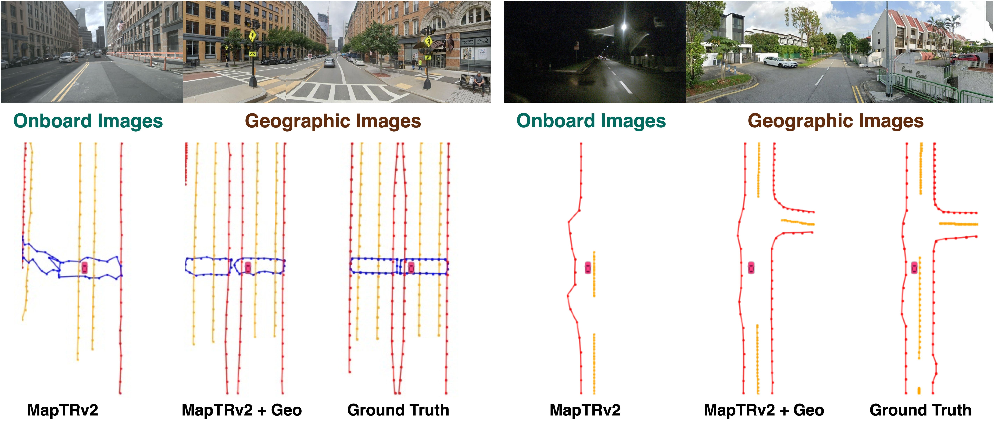
    

  

<!-- Occupancy Results -->

  

    

      
<strong>Occupancy Results.</strong> Extending FB-OCC and FlashOCC yields consistent mIoU improvements, particularly on static categories. The incorporation of geographic priors further boosts mIoU on static terrain, as they provide additional background information.

    

  

  

    

        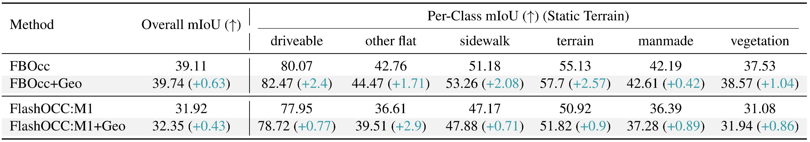
    

  

  

    

      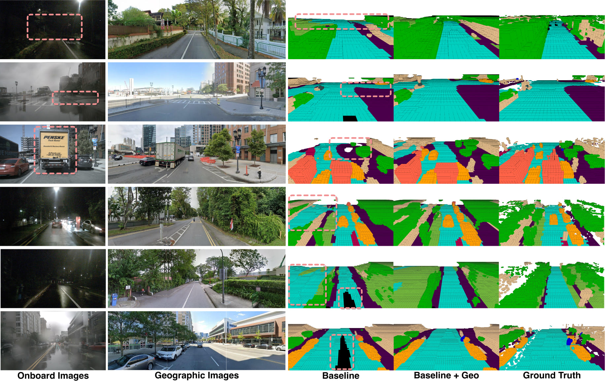
    

  

<!-- End-to-end Planning Results -->

  

    

      
<strong>End-to-end Planning Results.</strong> We evaluate how spatial retrieval improves safe planning with VAD. Geographic priors provide stable road-layout information, compensating for sensing failures under occlusion or low light. With similar trajectory accuracy, our method achieves better safety margins, reducing the collision rate from 0.55% to 0.48% in challenging night scenes.

    

  

  

    

      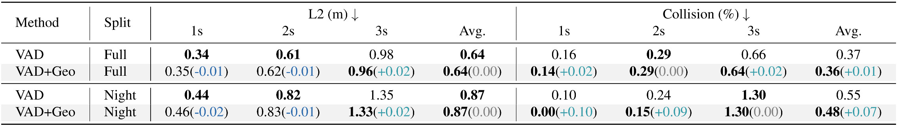
    

  

  

    

      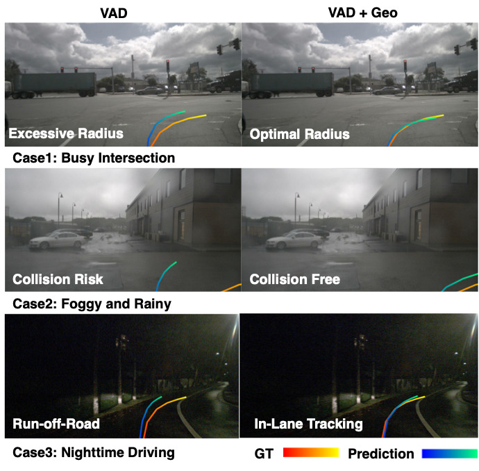
    

  

<!-- Conclusion -->

    

        <h2>Conclusion</h2>
        

        &emsp;&emsp;In this work, we present the spatial retrieval paradigm for AD, introducing geographic data as an additional input. We extend nuScenes with geographic data by Google Maps APIs and evaluate five key AD tasks on the extended <a href="https://huggingface.co/datasets/SpatialRetrievalAD/nuScenes-Geography-Data" target="_blank">nuScenes-Geography</a>  dataset. We propose a general plug-and-play Spatial Retrieval Adapter module as an intuitive baseline to incorporate geographic data. We propose Reliability Estimation  to adaptively fuse geographic information based on the reliability of the retrieved data. Extensive experiments show that the proposed paradigm can enhance the performance of multiple AD tasks, demonstrating the substantial potential of the new paradigm.
        

    

<!-- Citation Section -->

    

        <h2>Citation</h2>
        

            
If you use SpatialRetrievalAD in your research, please cite our paper:

            <pre><code>
</code></pre>
        

    

<!-- Acknowledgments Section -->

    

        <h2>Acknowledgments</h2>
        

            
We thank the following projects for their contributions to the development of this project:
                <a href="https://github.com/HuangJunJie2017/BEVDet" target="_blank">BEVDet</a>, 
                <a href="https://github.com/fundamentalvision/BEVFormer" target="_blank">BEVFormer</a>, 
                <a href="https://github.com/NVlabs/FB-BEV" target="_blank">FB-OCC</a>, 
                <a href="https://github.com/Yzichen/FlashOCC" target="_blank">FlashOCC</a>, 
                <a href="https://github.com/flymin/MagicDrive-V2" target="_blank">MagicDriveDiT</a>, 
                <a href="https://github.com/hustvl/MapTR" target="_blank">MapTR</a>, 
                <a href="https://github.com/hustvl/MapTR/tree/maptrv2" target="_blank">MapTRv2</a>, 
                <a href="https://www.nuscenes.org/" target="_blank">nuScenes</a>, 
                <a href="https://github.com/megvii-research/PETR" target="_blank">PETR</a>, 
                <a href="https://github.com/SenseTime-FVG/OpenDWM" target="_blank">UniMLVG</a>, 
                <a href="https://github.com/hustvl/VAD" target="_blank">VAD</a>
            

        

    

